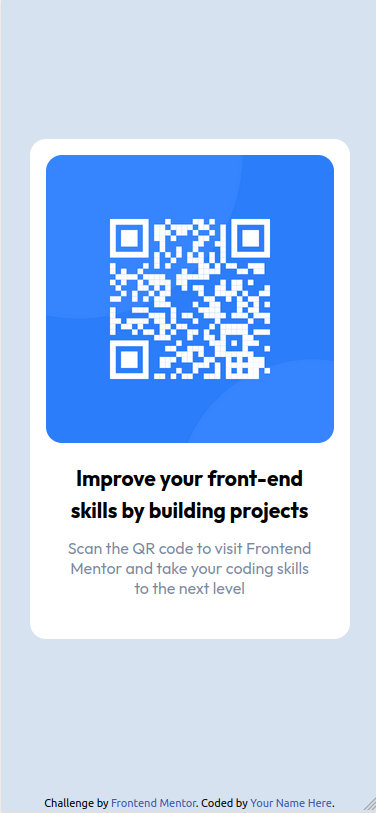

# Frontend Mentor - QR code component solution

This is a solution to the [QR code component challenge on Frontend Mentor](https://www.frontendmentor.io/challenges/qr-code-component-iux_sIO_H). Frontend Mentor challenges help you improve your coding skills by building realistic projects. 

## Table of contents

- [Overview](#overview)
  - [Screenshot](#screenshot)
  - [Links](#links)
- [My process](#my-process)
  - [Built with](#built-with)
  - [What I learned](#what-i-learned)
  - [Continued development](#continued-development)
  - [Useful resources](#useful-resources)
- [Author](#author)
- [Acknowledgments](#acknowledgments)


## Overview

### Screenshot

#### Desktop View


#### Mobile View


### Links

- Solution URL: [Add solution URL here](https://your-solution-url.com)
- Live Site URL: [Deploy](https://qr-code-component-main-ten-delta.vercel.app/)

## My process

### Built with

- Semantic HTML5 markup
- Tailwind CSS
- Flexbox
- Mobile-first workflow


### What I learned

With this first project from FrontEnd Mentor, I learned how to start the project using tailwind customization

```html
<script> 
    tailwind.config = {
      theme: {
        extend: {
          colors: {
            "light-gray": "hsl(212, 45%, 89%)",
            "grayish-blue": "hsl(220, 15%, 55%)",
            "dark-blue": "hsl(218, 44%, 22%)",
          },
          fontFamily: {
            "outfit": [
              "Outfit",
              "sans-serif",
            ]
          } 
        }
      }
    }
  </script>
```
And how to apply HTML semantic Tags, styling with tailwind CSS, applying Mobile Firt methodology.


```js
<div class="w-80 h-[500px] mx-auto bg-white p-4 rounded-2xl">
```

### Continued development

I want to improve my tailwind skills to build others projects faster.

### Useful resources

- [Tailwind Documentation](https://tailwindcss.com) - This helped me to understand how Tailwind CSS works.

## Author

- Github - [Luana Mayumi](https://github.com/LuanaMayumi)
- Frontend Mentor - [@LuanaMayumi](https://www.frontendmentor.io/profile/LuanaMayumi)
- Linkedin - [@luana-mayumi-dev](https://www.linkedin.com/in/luana-mayumi-dev/)

## Acknowledgments

- I'm very thankfull because he introduced me to this website when I was looking for a tool or website that could help me to improve my CSS Skills [Marlon Couto](https://github.com/devpatola)


